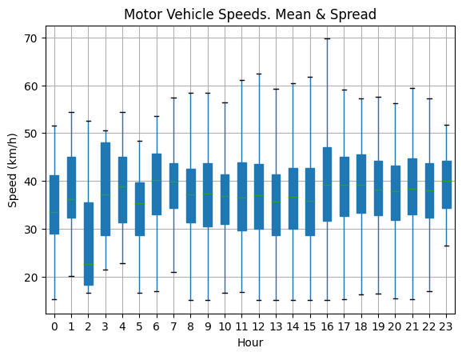

# B3N 2H2 Block

## Background

This block is a portion of Central Ave., in the Fairview neighbourhood of
Halifax. Established primarily in the early 20th century, it's streets are laid
out in a grid pattern up the eastern slope of Geizers Hill.

A typical street in Fairview is long, sloped, and wide. Additionally, Fairview
lacks a complete sidewalk network, with most streets having sidewalks on one
side, or none at all.

In the Fall of 2023, speed tables & humps were installed throughout much of
Fairview. This is HRM's current & primary strategy with respect to traffic
calming. The experiment will reference this implementation throughout.

## Parameters

These parameters will vary throughout experiments as the camera must be
calibrated with respect to its positioning against the road. As well, traffic
calming measures and road characteristics are captured here.

| Parameter                    |  Value           | Notes
| ---------------------------- | ---------------- | ---------
| Camera Distance from middle of  road    | 44ft             |
| Camera Height from road      | 13ft             |
| Calibration settings         | CAL_OBJ_MM_L2R = 4700, CAL_OBJ_MM_R2L = 4700 
| Road width                   | 357" (29.75 feet)                 | Sidewalk on one side only
| Road grade (slope)           | 7.5%                 | Primarily affects L2R travel (vehicles moving up hill). Slope begins a few metres after observed area
| Posted speed limit           |  50km/h          |

## Traffic Calming Measures

| Measure       | Distance & Positioning                       |
| ------------- | -------------------------------------------  |
| Speed Tables  | 1 speed table, at top of slope, roughly 100m from camera (L2R ->)  |
| Speed Humps   | n/a                                          |
| Chicanes      | n/a                                          |

## Results

Traffic was observed for 7 days, between Saturday November 04th 2023 to Friday
November 10th (inclusive, midnight to midnight)

| Metric                 |   Vaue
| ---------------------- | ---------
| 85th Percentile        | 47.41km/h
| 85th L2R (up slope)    | 50.55km/h
| 85th R2L (down slope)  | 42.59km/h
| Mean                   | 37.36km/h
| Total Traffic Observed | 4670
| Total Records Removed  | 291

Records were removed if they were captured traveling at a speed of 15km/h or
less. This was observed to be vehicles parking on nearby drive ways, the odd
cyclist, and delivery trucks pulling up to the curb.

A scatter plot shows us the data in a raw form. Each dot represents a single
observed vehicle. L2R and RL2 are acronyms for "Left To Right" and vice versa.
On this street, there is a grade/slope (documented above). In simple terms,
left to right (L2R) is going up hill. The 85th percentile is marked as the
dotted P85 line.

As well, a box plot shows us motor vehicle mean & spread over each hour in the
day. The data shown here is the same data (collected over a week), grouped by
the hour.

All data collected is available in the CSV located within this directory: [speed_results.csv](speed_results.csv)

## Reflections

The results of this test hold little surprises. This street is too wide
and the single speed table installed up the slope has little effect. At a speed
of 47km/h per hour at the 85th percentile, we see that most (85%) of vehicles
go at or lower than the posted speed limit. However, it is silly that a
residential road has a speed limit of 50km/h (the same posted limit as the
urban highway nearby, Joseph Howe)

Additionally, we can see what is more problematic: There is plenty of
opportunity to go faster than the posted speed limit. We see that 15% of
vehicles are traveling over 47km/h, with some reaching variances as high as
60km/h. It is further concerning that we see typical speeds increase for L2R
(Left to Right), as vehicles speed up the slope.

Prior to the installation of speed humps & tables, the primary concerns were
around the spread in speeds. That spread continues to be significant, and it is
clear that an optimal solution would be to reduce the width of the road.

This could be achieved by adding a side walk on the other side of the road
without encroaching on existing boulevards and property lines. The existing
sidewalk is 58 inches wide. If a similar sidewalk was implemented on the other
side, the resulting road width would be near 300" (25 feet), which is
comparable to traffic calmed streets like Liverpool (between 26 and 27 feet in
width dependent on location)

Depending on where the sidewalks are implemented and the resulting road width,
this could remove the ability for vehicles to park on both sides of the road.
Currently, vehicles may park on both sides with ample room for vehicles to pass
through (single file). There is no shortage of parking space on either side of
the road and the majority of homes have drive ways.
